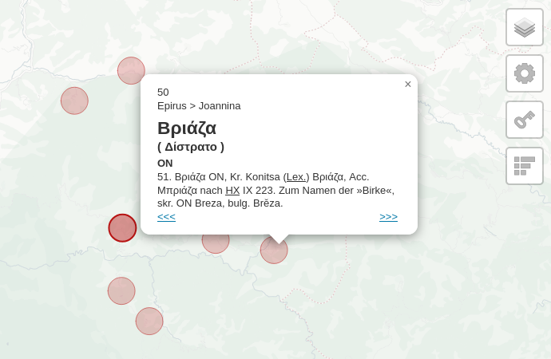

# dsig - Die Slaven in Griechenland

This is a project started with the goal of structuring and mapping the placenames listed by Max Vasmer in his work [Die Slaven in Griechenland](http://promacedonia.org/en/mv/index.html) on placenames of Slavic origin in modern Greece. The data can be used by historians, linguists and researchers of related topics.

[Explore the map here](https://dimithrandir.github.io/dsig/)

## Data

Data from the book entries is extracted to `data/book_data.csv`.

The geodata is in `data/mapped_data.csv`.

These two files are joined into `data/data.csv`.

## Progress

1592 / 2145 places mapped (74.22%)

Many of the places not found yet are only known from historical records and it is impossible to locate today, however there's still room for progress and any help is welcome.

## Acknowledgments

Libraries used:

* [Leaflet](https://leafletjs.com/)

* [Leaflet.GroupedLayerControl](https://github.com/ismyrnow/leaflet-groupedlayercontrol) plugin

* [Papa Parse](https://www.papaparse.com/)
